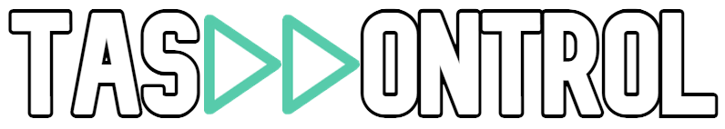

# Project description
<div align="center">
  
</div>

TasKKontrol is a package for automating tasks.

Basic structure:
- `Trigger` objects are used to keep track of when tasks need to execute.
- `Task` objects link together a `Trigger` object and a function that represents the task.
- A singular `Kontroller` object is used to manage all tasks.

## Triggers
This version of this package implements 3 types of triggers all inheriting the `Trigger` object.

### `ConditionTrigger` Object:
Defined using a function, which when returns `True` will activate the trigger.
Example usage:
```python
value = 10

def is_large ():
      global value
      return True if value > 5 else False

my_trigger = ConditionTrigger(is_large)
```

### `CompletionTrigger` Object:
Defined using another `Task` object, trigger activates when the task is finished executing.
Example usage:
```python
def true ():
      return True

def do_work ():
      print("Working")

first_task = Task(ConditionTrigger(true), do_work)
second_task = Task(CompletionTrigger(first_task), do_work)
```

### `TimerTrigger` Object:
Defined using another `Task` object, trigger activates when the task is finished executing.
Example usage:
```python
from time import time, gmtime

start_time = time()

delay_trigger = TimerTrigger(gmtime(start_time + 10)) # 10 second delay
```

Created and maintained by Artyom Yesayan